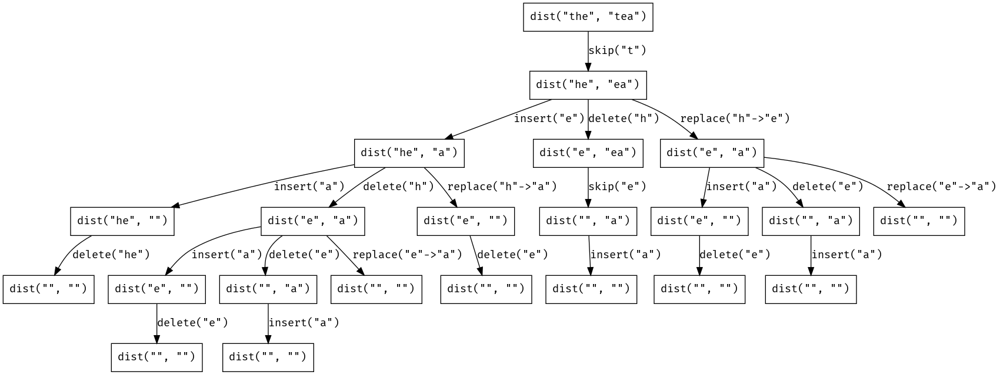
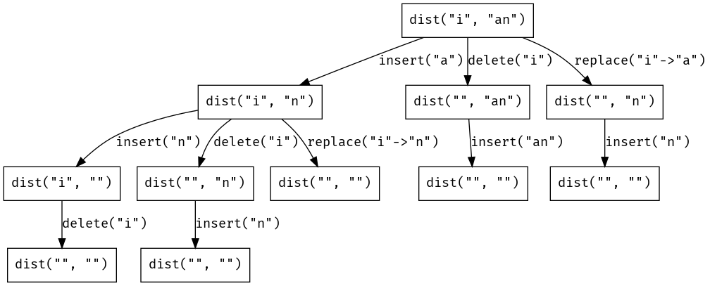
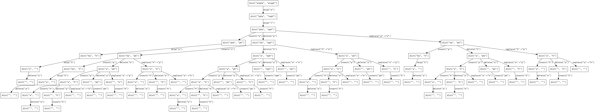

# Levenshtein Distance

How many moves does it take to transform the word "alpha" into "aleph", where a
move is one of the following
actions?

- Deleting a letter
- Inserting a letter
- Replacing one letter with another

For example, starting with **"alpha"**:

1. Insert **e** after **l**, producing **"alepha"**.
1. Delete the final **a**, giving **"aleph"**.

This isn't the only possible sequence of moves, though.
Here's another:

1. Replace **p** with **e**, giving **"aleha"**.
1. Replace **h** with **p**, giving **"alepa"**.
1. Replace **a** with **h**, producing **"aleph"**.

For any source and target strings, there may be many ways of transforming one
into the other.
But there's always a _shortest_ number of moves for doing so.
This shortest number of moves is called the _Levenshtein distance_ between the
two strings, and that's what we're interested in today.
For instance, we can go from "the" to "nap" in just _three_ moves:

1. Replace **t** with **n**, giving **"nhe"**.
1. Replace **h** with **a**, giving **"nae"**.
1. Replace **e** with **p**, giving **"nap"**.

Since there's no way to do it in fewer, the Levenshtein distance between "the"
and "nap" is 3.

## A Simple Recursive Algorithm

Our goal is to write the body of this function:

```python
def dist(src, tgt):
    """
    Compute the Levenshtein distance between src and tgt.
    """
    pass
```

We can start be observing some base cases:

- If the source string is **""** (the empty string), we can't do any better than
  inserting all of the characters in the target string.
  Since there are `len(tgt)` such characters, `dist("", tgt) == len(tgt)`
- Likewise if the target string is **""**, we can't do any better than deleting
  the letters from the source string.
  So `dist(src, "") == len(src)`.

That's enough to get us started:

```python
def dist(src, tgt):
    if not src:
        return len(tgt)
    elif not tgt:
        return len(src)

    # ...
```

If neither string is empty, then we compare the first characters in each.
If they're the same, we don't need to perform any moves on these characters, and
the distance between the two strings is simply the distance between the _tails_
of the two:

```python
def dist(src, tgt):
    if not src:
        return len(tgt)
    elif not tgt:
        return len(src)

    a, *src_tail = src
    b, *tgt_tail = tgt

    if a == b:
        return dist(src_tail, tgt_tail)

    # ...
```

If the first two characters don't match, it's not clear what the right move to
perform is without peeking at the rest of the strings.
In this case we just try _all_ possible moves, and pick the one that results in
the smallest distance:

```python
def dist(src, tgt):
    if not src:
        return len(tgt)
    elif not tgt:
        return len(src)

    a, *src_tail = src
    b, *tgt_tail = tgt

    if a == b:
        return dist(src_tail, tgt_tail)

    return 1 + min(dist(src, tgt_tail), dist(src_tail, tgt), dist(src_tail, tgt_tail))
```

For example, `dist(src, tgt_tail)` (the first term in the `min(...)`
expression), is computing the distance between the source string and the rest
(tail) of the target string.
This corresponds to _inserting_ the first character in the target string.

The second expression &mdash; `dist(src_tail, tgt)` &mdash; corresponds to
_deleting_ the first character in the source string; and the final expression
&mdash; `dist(src_tail, tgt_tail)` &mdash; to _replacing_ the first character in
the source string with the first character in the target string.
In each of the subexpressions, we're asking, "_supposing I performed X move_,
what's the distance between the resulting strings?"
We add 1 to the calculation to account for the single move that we're
performing.

I find this slightly tricky to wrap my head around, but it's a little easier to
grasp if we visualize the recursive calls that `dist` makes while computing the
distance between two strings.
For instance, to calculate `dist("the", "tea")`:



Each box corresponds to a call to `dist`, and each arrow indicates the move made
_during_ the call to `dist` (the one exception is "skip", which isn't really a
move; this occurs when the first two letters match).

Here's a trace of an even simpler calculation: `dist("i", "an")`, which might be
easier to follow:



These diagrams make a few things clear:

1. There are often multiple distinct minimal sequences of moves for transforming
   one string into another.
   For instance, to transform **"the"** into **"tea"**, there are two paths
   containing the minimal 2 (non-`skip`) moves:
   - Delete **h** and insert **a**.
   - Replace **h** with **e**, and replace **e** with **a**.
1. There's a lot of redundant computation.
   For example, the subcomputation `dist("e", "a")` is performed twice while
   computing `dist("the", "tea")`.
   This is even more glaring in larger computations like:

   _brace yourself_



One consequence of observation (2) is that our current implementation of `dist`
performs _very_ slowly on anything other than small inputs.
For instance, this calculation doesn't complete after even a minute on my
machine:

```python
dist("a man, a plan, a canal: panama", "a girl, a pearl, a lexus: canada")
```

In a minute we'll see a way to speed this up dramatically, but first (this is a
_lark_ after all), a quick diversion...

## A Levenshtein Machein

It's not too difficult to modify `dist` to return a minimal _sequence of moves_
for transforming one string into another, rather than the distance between them.
We can think of this as a sequence of instructions to be executed by a machine
that operates on the input string.
For instance, applying the instruction sequence:

```
SKIP
REPLACE h WITH e
REPLACE e WITH a
```

to the string **"the"** produces the string **"tea"**.

We'll need a way to represent the different moves applied to strings, AKA our
instructions.
For example, here's how we represent the "insert" instruction:

```python
class Insert:
    def __init__(self, elt):
        self.elt = elt

    def __str__(self):
        return f"INSERT {self.elt}"

    def __eq__(self, rhs):
        return self.elt == rhs.elt
```

The other instructions are similar:

```python
class Delete:
    def __init__(self, elt):
        self.elt = elt

    def __str__(self):
        return f"DELETE {self.elt}"

    def __eq__(self, rhs):
        return self.elt == rhs.elt


class Replace:
    def __init__(self, src, dst):
        self.src = src
        self.dst = dst

    def __str__(self):
        return f"REPLACE {self.src} WITH {self.dst}"

    def __eq__(self, rhs):
        return self.src == rhs.src and self.dst == rhs.dst


class Skip:
    def __str__(self):
        return "SKIP"

    def __eq__(self, rhs):
        return True
```

Generating instructions for transforming a source string into a target string
is just a matter of tweaking the return statements in `dist`:

```python
def gen_insts(src, tgt):
    """
    Generate a minimal sequence of instructions that transforms src into tgt.
    """
    if not src:
        return list(map(lambda y: Insert(y), tgt))
    elif not tgt:
        return list(map(lambda x: Delete(x), src))

    a, *src_tail = src
    b, *tgt_tail = tgt

    if a == b:
        return [Skip(), *gen_insts(src_tail, tgt_tail)]

    insert_b = gen_insts(src, tgt_tail)
    delete_a = gen_insts(src_tail, tgt)
    replace_ab = gen_insts(src_tail, tgt_tail)

    best = min(insert_b, delete_a, replace_ab, key=inst_count)

    if best is insert_b:
        return [Insert(b), *insert_b]
    elif best is delete_a:
        return [Delete(a), *delete_a]
    else:
        return [Replace(a, b), *replace_ab]
```

For example, when `src` is `""`, instead of returning a distance of `len(tgt)`,
we return a _list_ of `Insert` instructions, one for each letter remaining in
`tgt`.
The only wrinkle is at the end.
We first generate instruction sequences for the 3 different possible moves:
inserting the first letter in the target string, deleting the first letter in
the source string, and replacing the first letter in the source with the first
letter in the target.
We pick whichever involves the fewest (non-`Skip`) instructions:

```python
def inst_count(insts):
    """
    Counts the number of nontrivial instructions in insts.
    """
    return len(list(filter(lambda i: not isinstance(i, Skip), insts)))
```

Here are the instructions produced by `gen_insts("the", "tea")`:

```
SKIP
DELETE h
SKIP
INSERT a
```

and by `gen_insts("pagoda", "pierogi")`:

```
SKIP
INSERT i
REPLACE a WITH e
REPLACE g WITH r
SKIP
REPLACE d WITH g
REPLACE a WITH i
```

Here's an example of what the initial internal state of the machine looks like:

```
+ --- + --- + --- +
|  t  |  h  |  e  |
+ --- + --- + --- +
   ^
   |
   j

output: []

-> SKIP
   DELETE h
   SKIP
   INSERT a
```

We maintain an index into the source string (`j`), an output list of characters,
and a current instruction.
Operating the machine is simply a matter of doing the right thing for each
instruction:

- If the instruction is `INSERT c`, append `c` to the output.
- If it's `DELETE c`, don't add any characters to the output, but advance `j`.
- If it's `REPLACE c WITH d`, append `d` to the output, _and_ advance `j`.
- Finally, if it's `SKIP c`, append `c` to the output, _and_ advance `j`.

```python
def run(src, insts):
    """
    Apply insts to src.
    """
    cs = []
    j = 0
    for i in insts:
        if isinstance(i, Insert):
            cs.append(i.elt)
        elif isinstance(i, Delete):
            if src[j] != i.elt:
                raise ValueError(f"Expected {i.elt}")
            j += 1
        elif isinstance(i, Replace):
            if src[j] != i.src:
                raise ValueError(f"Expected {i.src}")
            cs.append(i.dst)
            j += 1
        elif isinstance(i, Skip):
            cs.append(src[j])
            j += 1

    return "".join(cs)
```

And that's all there is to it.
To summarize very concisely, for any `src` and `tgt` strings:

```python
run(src, gen_insts(src, tgt)) == tgt
```

...and now, back to the main event.

## Speeding Things Up

### Memoize?

We noticed earlier that the same subtrees appear multiple times in any but the
smallest traces.
Any time the same computation is being performed multiple times, it's worth
trying to speed things up with [_memoization_](https://en.wikipedia.org/wiki/Memoization).
Memoizing our recursive `dist` implementation would have the effect of "merging"
all of the common subtrees in the trace diagrams.
Unfortunately, memoization isn't a panacea (alas, nothing is).
Particularly when arguments are compound objects (like strings or lists), we
incur the overhead of hashing them into things that can be used as keys in a
cache.
This overhead isn't too bad in this case, but there's a better approach.

### Dynamic Programming

Memoization is really general: it works in cases where a function might
conceivably be applied to an infinite variety of inputs.
But in this case we know _in advance_ the exact inputs whose results we want to
cache in order to avoid redundant recomputations.
Our recursive implementation performs these calculations on-demand, but we could
just as easily perform them in advance.
The downside is that we might do more work than necessary, but the calculations
involved are so simple that this doesn't matter.

Here's the idea: we allocate a two-dimensional array with a row for each
_suffix_ of the source string, and a column for each _suffix_ of the target
string.
A string `s` has `len(s) + 1` suffixes.
For example:

```python
"tea"[0:] == "tea"
"tea"[1:] == "ea"
"tea"[2:] == "a"
"tea"[3:] == ""
```

Here's the first part of our new implementation:

```python
def dist(src, tgt):
    m = len(src)
    n = len(tgt)
    d = [[0 for _ in range(n + 1)] for _ in range(m + 1)]

    # ...
```

We should visualize this table containing the letters of the source string
running down the rows, and the letters of the target across the top.
For instance, here's the table for the calculation `dist("the", "tea")`:

```
     t     e     a
  + --- + --- + --- + --- +
t |     |     |     |     |
  + --- + --- + --- + --- +
h |     |     |     |     |
  + --- + --- + --- + --- +
e |     |     |     |     |
  + --- + --- + --- + --- +
  |     |     |     |     |
  + --- + --- + --- + --- +
```

This table will contain the distances between all suffixes of the source and
target strings.
That is, the entry `d[i][j]` will contain `dist(src[i:], tgt[j:])`.

The first order of business is to populate these "empty suffix" cells using some
_boundary conditions_, analogous to the base cases in the recursive
implementation.
Specifically, we know that

```python
dist(src[i:], "") == len(src[i:])
                  == len(src) - i
                  == m - i
```

and likewise:

```python
dist("", tgt[j:]) == len(tgt[j:])
                  == len(tgt) - j
                  == n - j
```

This allows us to fill out the rightmost column and bottom row:

```
     t     e     a
  + --- + --- + --- + --- +
t |     |     |     |  3  |
  + --- + --- + --- + --- +
h |     |     |     |  2  |
  + --- + --- + --- + --- +
e |     |     |     |  1  |
  + --- + --- + --- + --- +
  |  3  |  2  |  1  |  0  |
  + --- + --- + --- + --- +
```

As an example, there's a 2 in the rightmost column because:

```python
d[1][3] == dist(src[1:], tgt[3:])
        == dist("he", "")
        == 2
```

and likewise there's a 3 in the bottom row because:

```python
d[3][0] == dist(src[3:], tgt[0:])
        == dist("", "tea")
        == 3
```

Here's the code to initialize these cells:

```python
def dist(src, tgt):
    # ...

    for i in range(m + 1):
        d[i][n] = m - i

    for j in range(n + 1):
        d[m][j] = n - j

    # ...
```

Filling in the remaining entries resembles the recursive cases in our original
implementation.
We iterate backwards through the rows and columns, starting from the known
boundary and moving towards the upper lefthand corner:

```python
def dist(src, tgt):
    # ...

    for i in reversed(range(m)):
        for j in reversed(range(n)):
            # Fill in the remaining cells in d.

    # ...
```

To compute the value of the cell `d[i][j]`, we first check if the character at
index `i` in the source string is the same as the character at index `j` in the
target string (`src[i] == tgt[j]`).
If so, the distance between `src[i:]` and `tgt[j:]` is the same as the
distance between `src[i + 1:]` and `tgt[i + 1:]` (that is, the distance
between the tails).
But this is just the value at `d[i + 1][j + 1]`.
So in this case, `d[i][j] = d[i + 1][j + 1]`:

```python
def dist(src, tgt):
    # ...

    for i in reversed(range(m)):
        for j in reversed(range(n)):
            a = src[i]
            b = tgt[j]
            if a == b:
                d[i][j] = d[i + 1][j + 1]

    # ...
```

If `src[i] != tgt[j]`, we need to consider the three possible moves we can
make, just like in the recursive case.
In this case, however, we've already computed the distances involved.
The distance between the suffixes that results from inserting `tgt[j]` is
located at `d[i][j + 1]`, the result from deleting `src[i]` is at `d[i + 1][j]`,
and from replacing `src[i]` with `tgt[j]` is at `d[i + 1][j + 1]`.
We just need to look them up and select the smallest:

```python
def dist(src, tgt):
    # ...

    for i in reversed(range(m)):
        for j in reversed(range(n)):
            a = src[i]
            b = tgt[j]
            if a == b:
                d[i][j] = d[i + 1][j + 1]
            else:
                d[i][j] = 1 + min(d[i + 1][j], d[i][j + 1], d[i + 1][j + 1])

    # ...
```

Finally, we return `d[0][0]`, which holds the distance between the suffixes
`src[0:]` and `tgt[0:]`, i.e. the original source and target strings themselves:

```python
def dist(src, tgt):
    m = len(src)
    n = len(tgt)
    d = [[0 for _ in range(n + 1)] for _ in range(m + 1)]

    for i in range(m + 1):
        d[i][n] = m - i

    for j in range(n + 1):
        d[m][j] = n - j

    for i in reversed(range(m)):
        for j in reversed(range(n)):
            a = src[i]
            b = tgt[j]
            if a == b:
                d[i][j] = d[i + 1][j + 1]
            else:
                d[i][j] = 1 + min(d[i + 1][j], d[i][j + 1], d[i + 1][j + 1])

    return d[0][0]
```

### Using Less Space

The eagle-eyed will have noticed that, although we allocated a two-dimensional
table for our calculations, we only ever referenced the previous row when
computing the next.
That is, when calculating `d[1][2]`, we only referred to cells `d[2][2]`,
`d[1][3]` and `d[2][3]`, and _not_, for instance, `d[5][7]`.
We can take advantage of this fact by using two one-dimensional lists for our
calculations, performing the computations in a kind of "leap frog" style.

Here's what that looks like:

```
     t     e     a
  +     +     +     +     +
t
  +     +     +     +     +
h
  + --- + --- + --- + --- +
e |     |     |     |     | <- v1
  + --- + --- + --- + --- +
  |  3  |  2  |  1  |  0  | <- v0
  + --- + --- + --- + --- +
```

We allocate two arrays, `v0` and `v1`, and initialize `v0` using the same
boundary condition as before.
We then iterate backwards over the suffixes of the target string, filling in the
cells in `v1` as we go.
This requires little more than translating lookups in `d` to lookups in either
`v0` or `v1`:

- `d[i + 1][j] == v0[i][j]`
- `d[i][j + 1] == v1[i][j + 1]`
- `d[i + 1][j + 1] == v0[i][j + 1]`

which allows us to populate the entries in `v1`:

```
     t     e     a
  +     +     +     +     +
t
  +     +     +     +     +
h
  + --- + --- + --- + --- +
e |  2  |  1  |  1  |  1  | <- v1
  + --- + --- + --- + --- +
  |  3  |  2  |  1  |  0  | <- v0
  + --- + --- + --- + --- +
```

We then swap the addresses pointed to by `v0` and `v1`, effectively producing
the following situation:

```
     t     e     a
  +     +     +     +     +
t
  + --- + --- + --- + --- +
h |     |     |     |     | <- v1
  + --- + --- + --- + --- +
e |  2  |  1  |  1  |  1  | <- v0
  + --- + --- + --- + --- +

  +     +     +     +     +
```

We just rinse and repeat until we've completed the top row, at which point the
distance we're interested in is located in `v0[0]` (_not_ `v1[0]`, since we swap
`v0` and `v1`, even after the final iteration).
Here's the implementation:

```python
def dist(src, tgt):
    m = len(src)
    n = len(tgt)

    v0 = [n - j for j in range(n + 1)]
    v1 = [0 for _ in range(n + 1)]

    for i in reversed(range(m)):
        v1[n] = m - i
        for j in reversed(range(n)):
            a = src[i]
            b = tgt[j]
            if a == b:
                v1[j] = v0[j + 1]
            else:
                v1[j] = 1 + min(v1[j + 1], v0[j], v0[j + 1])

        v1, v0 = v0, v1

    return v0[0]
```

And that's all there is to it.

## Addendum

I still have a few questions about why these algorithms work.
For instance, why are we guaranteed to find the shortest sequence of moves by
walking through the strings from start to finish?
Is it obvious that there's nothing to be gained by first making some moves in
the center of the source string, and then moving out towards the edges?

### Backwards?

The implementations I've shown here are slightly different from the ones
presented in the [Wikipedia article](https://en.wikipedia.org/wiki/Levenshtein_distance#Iterative_with_full_matrix).
I wanted to keep the iterative and recursive algorithms as similar as possible;
in the Wikipedia article, the recursive algorithm processes _suffixes_, whereas
the iterative algorithms process _prefixes_.
This isn't an issue, per se, but it does require convincing yourself that:

```python
dist(src, tgt) == dist(src[::-1], tgt[::-1])
```

This _seems_ totally reasonable, but it's not yet _obvious_ to me...

### Tools

I had a lot of fun building a few tools to help visualize these algorithms.
The first, which renders the traces followed by the recursive implementation, is
available at [bin/trace.py](./bin/trace.py).
The second, which builds an HTML table showing the distance array populated by
the iterative algorithm, is at [bin/tabulate.py](./bin/tabulate.py).
